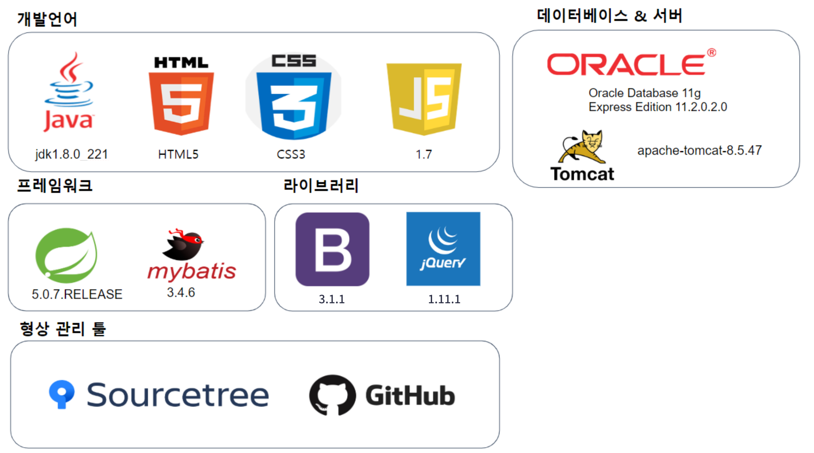

# DailyCookingPJ
## 시스템 개요
#### 회원들이 게시물 등록을 통해 자신만의 음식 레시피를 공유하며
#### 홈페이지 사용자들이 음식을 만들 때 도움을 주기 위한 시스템이다.

## 개발 환경

## 주요 기능
- 사용자
  1. 회원가입
  1. 아이디 찾기, 비밀번호 찾기
  1. 마이페이지
      - 회원정보 - 수정, 탈퇴, 비밀번호 변경
      - 즐겨찾기(스크랩)한 게시물 목록
      - 작성한 게시물 목록
      - 작성한 댓글 목록
      - 관리자에게 문의/건의한 목록
  1. 게시물 등록 - 파일첨부(이미지), 수정, 삭제
  1. 게시물 보기
      - 게시물 목록 - 최신순, 인기순, 조회순으로 나열
      - 게시물 검색 기능 - 아이디, 제목, 태그로 검색
      - 게시물 추천(좋아요) , 즐겨찾기(스크랩) 기능
      - 댓글 작성, 수정, 삭제
      - 게시물 신고하기
  1. 관리자에게 문의/건의 하기
- 관리자
  1. 회원 관리
      - 전체 회원 목록 ,회원 정보 상세보기, 회원 탈퇴, 정지 회원 목록,  회원 정지, 회원 정지 해제 기능
  2. 게시물 관리
      - 레시피 게시물 목록, 레시피 신고 게시물 목록, 게시물로 이동, 게시물 삭제
  3. 건의/문의사항 관리
      - 건의/문의사항 목록, 건의/문의사항 상세 보기, 건의/문의사항 답변하기 기능
  4. 관리자 정보
      - 정보 수정, 비밀번호 변경
